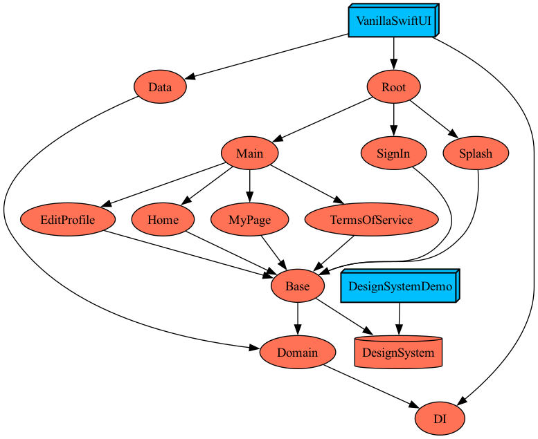

# 🍦 Vanilla SwiftUI

- 추가 라이브러리 없이, SwiftUI를 기반으로 구현한 구조 설계 및 검증 프로젝트
- 학습 및 아키텍처 검증 목적의 실험적 프로젝트

# 📌 Project Goal

- 외부 라이브러리 의존성을 최소화한 아키텍처 설계
- Circular Dependency 없이 모듈 간 데이터/이벤트 흐름 구축
- SwiftUI + NavigationStack + MVVM-C 환경에서 화면 상태 흐름을 구조적으로 관리
- 모듈 단위 개발을 위한 Tuist 기반 멀티 모듈 구성
- Coordinator를 통한 화면 전환, 화면 간 데이터 전달
- DI를 통한 명확하고 예측 가능한 의존성 주입
- 확장성과 유지보수성을 고려한 앱 구조 마련
  
# 🛠 Tech Stack

- SwiftUI
- MVVM-C (Coordinator Pattern)
- Combine
- Clean Architecture
- Dependency Injection (Swinject)
- Tuist (모듈화)

# 📊 Tuist Graph

  

# 🧩 가장 큰 고민  

**모듈 간 데이터 전달 & 화면 흐름**  
모듈 간 데이터를 주고받는 방법은 다양하지만, 본 프로젝트에서는 다음 요구 사항을 반드시 충족해야 했다.  

**요구 사항**  

1. 하위 모듈은 상위 모듈을 몰라야 한다.  
2. Clean Architecture의 의존성 규칙(상위 → 하위 단방향)을 철저히 지켜야 한다.  
3. 실무에서도 확장 가능한 안정적인 구조여야 한다.  

Tuist 기반으로 모듈을 분리한 만큼, 의존성 방향을 유지하면서도 `Circular Dependency`를 방지하는 것이 가장 큰 고민이었다.  
이 문제를 해결하고 위 요구 사항을 모두 만족시키기 위해 `Mediator 패턴`을 도입하여 모듈 간 이벤트 및 데이터 흐름을 중재하도록 설계했다.  

# 🧠 Mediator 패턴  

이번 프로젝트에서는 TCA에서 사용했던 구조와 유사한 방식으로 Mediator 패턴을 적용했다.  
TCA에서는 Root를 담당하는 Coordinator가 하위 모듈들을 소유하고,  
상위 모듈이 하위 모듈의 액션을 감지하여 다른 모듈로 전달하는 흐름을 구축한다.  

본 프로젝트에서도 마찬가지로,  
상위 모듈(Main)이 하위 모듈(MyPage, TermsOfService)의 이벤트를 감지하고 중재하는 방식이 필요했다.  
이를 하나의 예시를 통해 설명하겠다.  

```swift  
Main
├─ MyPage
└─ TermsOfService  

[TermsOfService] ──(1)──> [MainCoordinator] ──(2)──> [MyPage]
     버튼 탭                     이벤트 변환             Alert 표시

Step 1: TermsOfService 버튼 탭 (dataTransferButtonTapped)
        ↓
Step 2: termsEventPublisher.send(.transferData)
        ↓
Step 3: MainCoordinator가 수신 및 변환
        ↓
Step 4: myPageEventPublisher.send(.dataReceived)
        ↓
Step 5: MyPage가 수신하여 Alert 표시
```   

이 흐름을 통해 TermsOfService와 MyPage는 서로에 대해 전혀 알 필요가 없으며,  
오직 최상위 모듈(Main)만이 이벤트 흐름을 중재하게 된다.  

---  

**Mediator 패턴의 장점**  
- 모듈 간 직접 의존을 제거하여 Circular Dependency 방지
- Clean Architecture의 단방향 의존성 원칙 유지
- 상위 Coordinator(Main)가 전체 화면 흐름을 일관성 있게 제어
- 모듈 변경 시 영향 범위가 최상위 모듈로 제한되어 확장성 증가

# 🎬 끝으로...

이번 프로젝트는 SwiftUI 환경에서  
`Clean Architecture`, `MVVM-C`, `모듈화`, `Mediator 패턴`을 실제로 적용해보며  
구조 설계에 대한 개인적인 고민을 정리하기 위한 목적이었다.  

사실 이 프로젝트를 시작한 가장 큰 이유는  
TCA가 구조적으로 강력한 대신, 프레임워크 중심의 아키텍처에 너무 의존적이라는 점 때문이었다.  
프로젝트의 구조가 TCA 자체에 종속되는 느낌을 피하고 싶었고,  
가능하면 외부 라이브러리 없이 SwiftUI와 Combine만으로도 충분히 아키텍처를 설계할 수 있는지 확인해보고 싶었다.  

그 과정에서
- 모듈 간 데이터 흐름을 어떻게 깔끔하게 유지할지
- Circular Dependency 없이 화면 이동과 이벤트 전달을 어떻게 관리할지
- Coordinator와 Mediator 패턴을 SwiftUI에 자연스럽게 녹일 수 있을지 같은 문제들을 직접 고민하고 해결해봤다.

결과적으로 기능 자체보다 “유지보수하기 좋은 구조는 무엇인가?”에 대해 깊게 생각해볼 수 있었던 프로젝트였다.  

# 🙏 TODO

- [x] Task A
  - MyPageView -> TermsOfServiceView 정보 전달
  - MyPageView -> TermsOfServiceView 이동 (Push)
  - Associated value 사용
- [x] Task B
  - MyPageView <- TermsOfServiceView 정보 전달
  - MyPageView -> TermsOfServiceView 이동 (Push)
  - TermsOfServiceView의 버튼 누를 시 정보 전달하면서 Pop
  - MyPageView가 받은 정보로 alert 띄우기
- [x] Task C
  - MyPageView -> TermsOfServiceView 이동 (Push)
  - TermsOfServiceView 의 액션 감지, MyPageView 액션 감지
  - MyPageView 의 timer 시작, TermsOfServiceView State 변경
  - TermsOfServiceView가 사라지면, MyPageView Timer 중단
- [x] Task D
  - Home 에서 Sheet Present
  - Sheet의 버튼 감지 -> dismiss + Home의 State 변경